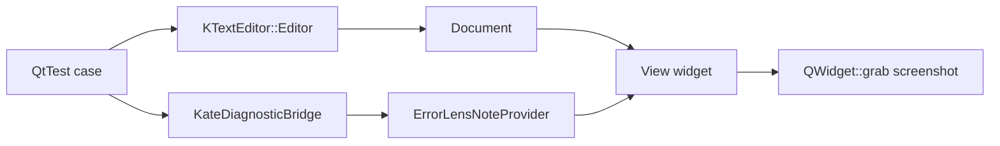

# Error Lens UI Smoke Test Design

## Background
Kate Error Lens renders diagnostics through `KTextEditor::InlineNoteProvider`. The project currently has no automated tests.

## Problem
The build can compile while the rendered inline note path breaks at runtime. A test should exercise a real `KTextEditor::View` with a registered provider, using only public KTextEditor APIs.

## Questions and Answers
- Q: Should the test launch Kate?
  - A: No. It creates a `KTextEditor::Editor` document/view in-process, which keeps the plugin standalone.
- Q: Should the test assert exact pixels?
  - A: No. It compares screenshots before and after injecting diagnostics and checks for a visible magenta diagnostic color. This is robust across fonts and themes.

## Design
Add a `BUILD_TESTING` guarded QtTest executable:

The test creates a document, creates a view, registers `ErrorLensNoteProvider`, captures a baseline image, injects one error diagnostic through `KateDiagnosticBridge::setDocumentDiagnostics`, waits for rendering, and verifies the captured view changes and contains magenta-tinted pixels from the configured Error Lens colors.

## Implementation Plan
1. Add CTest/QtTest support behind `BUILD_TESTING`.
2. Add `tests/errorlensuitest.cpp` with a headless KTextEditor view smoke test.
3. Run the test with `QT_QPA_PLATFORM=offscreen`.
4. Keep the plugin install target unchanged.

## Examples
✅ `ctest --test-dir build --output-on-failure -R errorlens_ui_test`

❌ Launching a full Kate process and depending on private LSP plugin internals.

## Trade-offs
This test validates UI rendering through public APIs and stays stable in CI/headless environments. It avoids exact screenshot baselines because KTextEditor font, DPI, and theme settings vary across systems.
